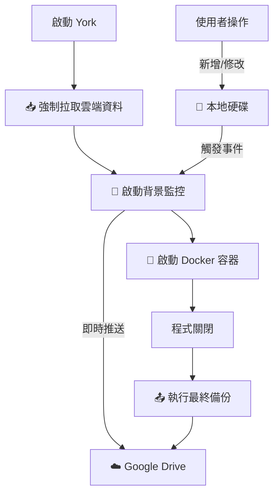

# 🤖 York (The AI Project Brain)


York 是一個專為 AI Agent 設計的「專案知識管理大腦」。它透過 Model Context Protocol (MCP) 為 Claude 等 AI 提供深度專案認知能力，包含語意搜尋、結構感知與長期記憶管理。


## ✨ 核心特色

1.  **🧠 雙腦協作架構 (Cognitive Architecture)**
    *   **結構認知 (Structure)**: 自動偵測專案框架 (Laravel, FuelPHP, React...) 並理解目錄意義。
    *   **知識記憶 (Knowledge)**: 儲存業務邏輯、開發規範與決策紀錄。

2.  **🔍 混合檢索系統 (Hybrid Search)**
    *   結合 **關鍵字搜尋 (BM25)** 與 **語意搜尋 (Vector Embedding)**。
    *   使用 **RRF (Reciprocal Rank Fusion)** 演算法優化排序，精準度 100%。

3.  **⚡ 高效能 Python 核心**
    *   基於 `FastMCP` 與 `uv` 套件管理。
    *   內建 `LanceDB` 向量資料庫（無須額外安裝 Service）。
    *   支援 `SentenceTransformers` 本機 Embedding 模型。

---

## 🚀 快速開始 (Docker 部署)

這是最推薦的安裝方式，確保環境完全隔離且一致。

### 1. 初始化設定

執行安裝精靈，它會檢查環境、生成 `.env` 並建置 Docker Image：

```bash
./setup.sh
```

### 2. 設定 Claude Desktop

將安裝精靈生成的配置加入您的 Claude 設定檔：

#### macOS/Linux

設定檔位置: `~/Library/Application Support/Claude/claude_desktop_config.json` (macOS)

```json
{
  "mcpServers": {
    "york": {
      "command": "/您的/絕對路徑/到/york/start.sh"
    }
  }
}
```

#### Windows (Antigravity)

設定檔位置: `%USERPROFILE%\.gemini\antigravity\mcp_config.json`

```json
{
  "mcpServers": {
    "york": {
      "command": "powershell.exe",
      "args": [
        "-NoProfile",
        "-ExecutionPolicy",
        "Bypass",
        "-File",
        "/您的/絕對路徑/到/york/start.ps1"
      ]
    }
  }
}
```

> **注意**: Windows 使用者需使用 `start.ps1` (PowerShell 腳本) 而非 `start.sh`。請將路徑替換為您的實際安裝位置。

### 3. 重啟 Claude

重啟 Antigravity 或是 Claude Desktop 後，您應該能看到 🛠️ 圖示中出現 York 的工具。

---

## ☁️ Windows 雲端同步架構 (Auto-Sync)

Antigravity 版本 (Windows PowerShell) 內建了強大的**「本地優先 + 雲端備份」**機制，解決了 Docker 無法直接掛載 Google Drive 的問題。

### ✨ 核心功能
1.  **🚀 啟動即拉取 (Pull)**: 每次啟動時，強制從 Google Drive 拉取最新資料到本地，確保資料一致。
2.  **👀 即時監控 (Watch)**: 運行期間，背景服務即時監控本地變更，秒級同步至雲端。
3.  **🛡️ 關閉即備份 (Backup)**: 程式結束時執行最後一次完整備份。

### ⚙️ 設定方式
在 `.env` 中設定兩個變數：

```bash
# 1. 本地路徑 (Docker 實際掛載，速度快)
YORK_KNOWLEDGE_ROOT=./york-knowledge

# 2. 雲端路徑 (自動備份目的地)
REMOTE_KNOWLEDGE_ROOT=G:\我的雲端硬碟\knowledge
```

### 🔄 工作流程


---

## 🛠️ 可用工具 (MCP Tools)

York 提供 12 個強大的工具，分為三大類：

### 📚 知識管理 (Knowledge)
| 工具名稱 | 描述 |
| :--- | :--- |
| `save_knowledge_tool` | 儲存文件到知識庫，並自動同步向量索引 |
| `read_knowledge_tool` | 讀取特定知識文件的內容與 metadata |
| `list_knowledge_tool` | 列出專案中的所有知識文件 |
| `delete_knowledge_tool` | 刪除知識文件與對應的向量數據 |
| `get_project_knowledge_tool` | 取得專案的完整知識彙整 (project-knowledge.md) |

### 🔍 搜尋與檢索 (Retrieval)
| 工具名稱 | 描述 |
| :--- | :--- |
| `search_knowledge_tool` | 混合搜尋 (關鍵字+語意)，支援 RRF 排序與結構化過濾 |
| `reindex_knowledge_tool` | 手動觸發特定專案的索引重建 |
| `get_vector_db_stats_tool` | 查看向量資料庫狀態 (統計、快取命中率) |

### 🏗️ 結構認知 (Structure)
| 工具名稱 | 描述 |
| :--- | :--- |
| `detect_project_structure_tool` | **自動偵測** 專案框架並生成 `project.structure.yml` 建議 |
| `get_project_structure_tool` |讀取目前的專案結構配置 |
| `save_project_structure_tool` | 儲存結構配置並觸發結構索引更新 |
| `list_projects_tool` | 列出此工作區管理的所有專案 |

### 🔗 可用資源 (Resources - 支援 @ 引用)

Resource 是讓您直接將特定知識「注入」到 AI 上下文 (Context) 的捷徑。在 Claude 中輸入 `@` 即可使用。

| URI 模式 | 用途 | 範例 |
| :--- | :--- | :--- |
| `project://{name}/structure` | **專案地圖**：讀取專案目前的目錄結構與架構說明。 | `@project://repository_name/structure` |
| `project://{name}/knowledge/{file}` | **精準知識**：讀取特定的知識文件。 | `@project://repository_name/knowledge/auth.md` |

---

## 📂 專案結構

```
york/
├── src/
│   ├── agent_server/    # MCP Server 定義與入口
│   ├── knowledge/       # 知識管理核心 (CRUD, Sync, Search)
│   ├── services/        # 基礎服務 (VectorStore: Singleton + LRU)
│   ├── structure/       # 結構認知核心 (Detector, YAML Handler)
│   ├── models/          # Pydantic 資料模型定義
│   └── utils/           # 通用工具 (Logger, Project Helper)
├── scripts/             # 功能演示腳本 (demo.py)
├── tests/               # Pytest 測試套件
├── Dockerfile           # 生產環境映像檔定義
├── start.sh             # 容器啟動腳本
└── setup.sh             # 安裝精靈
```

---

## 🔧 維運工具

York 在根目錄提供了一系列腳本方便維護。每個工具都有 Shell 和 PowerShell 兩個版本：

### 📊 知識庫儀表板
啟動視覺化介面，瀏覽和管理知識庫內容。

- **macOS/Linux**: `./dashboard.sh`
- **Windows**: `.\dashboard.ps1`
- 訪問: `http://localhost:8501`

### 🔍 資料庫檢查工具
查看向量資料庫的詳細內容與統計資訊。

- **macOS/Linux**: `./inspect_db.sh`
- **Windows**: `.\inspect_db.ps1`

### 🔄 知識庫重建索引
強制重新掃描並重建所有專案的向量索引。

- **macOS/Linux**: `./migrate_knowledge.sh`
- **Windows**: `.\migrate_knowledge.ps1`

### 💾 資料庫管理工具
備份或重置 LanceDB 向量資料庫。

- **macOS/Linux**: `./ops_db.sh [backup|reset|help]`
- **Windows**: `.\ops_db.ps1 [backup|reset|help]`

使用範例：
```bash
# macOS/Linux
./ops_db.sh backup    # 備份資料庫
./ops_db.sh reset     # 重置資料庫 (會先自動備份)

# Windows
.\ops_db.ps1 backup   # 備份資料庫
.\ops_db.ps1 reset    # 重置資料庫 (會先自動備份)
```

### 🧪 測試執行工具
在本機環境執行完整的測試套件 (需要安裝 `uv`)。

- **macOS/Linux**: `./test.sh`
- **Windows**: `.\test.ps1`

---

## 📝 開發者指南

若您想在本機直接開發 (不使用 Docker)：

### 安裝 uv

**macOS/Linux**:
```bash
curl -LsSf https://astral.sh/uv/install.sh | sh
```

**Windows (PowerShell)**:
```powershell
irm https://astral.sh/uv/install.ps1 | iex
```

### 開發步驟

1.  安裝依賴: `uv sync --all-extras`
2.  執行測試: `uv run pytest`
3.  啟動 Server: `uv run python -m src`

---
